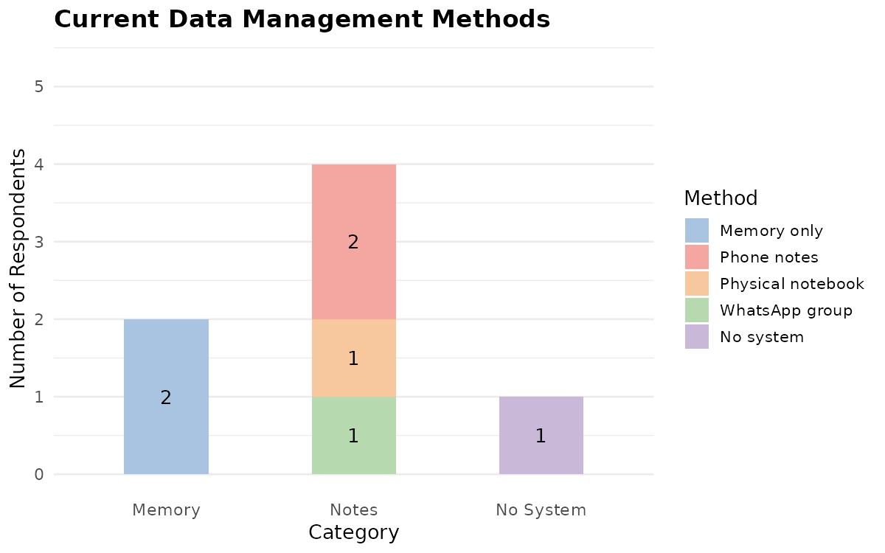
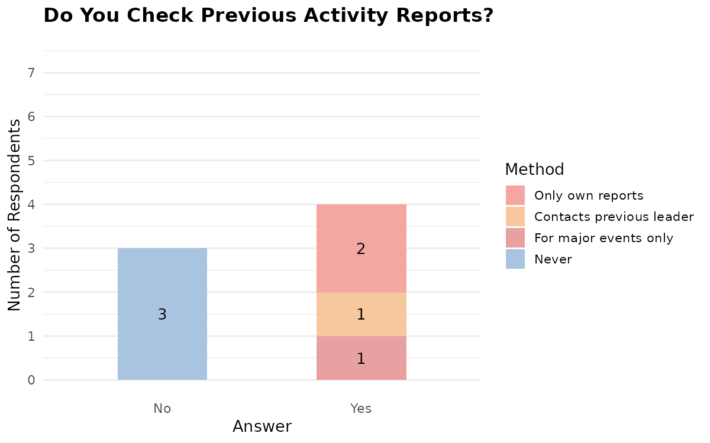
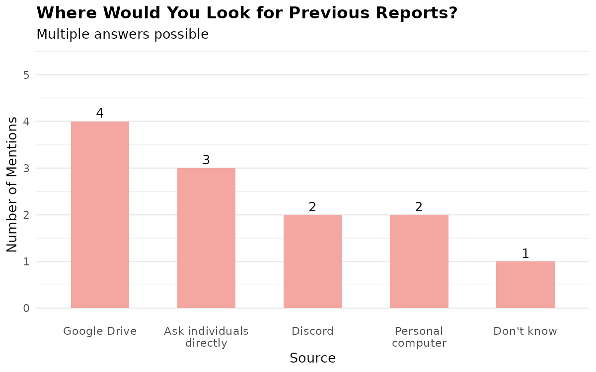
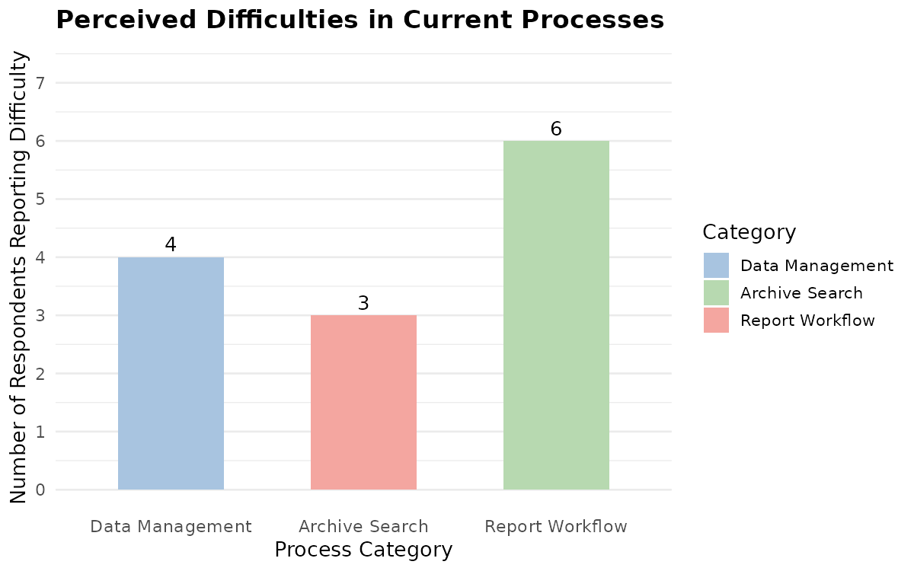
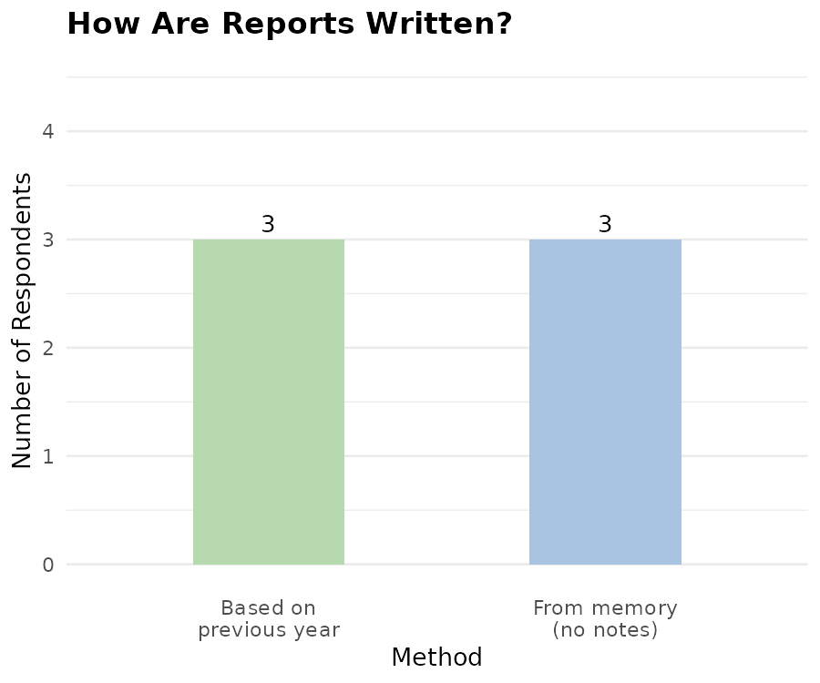
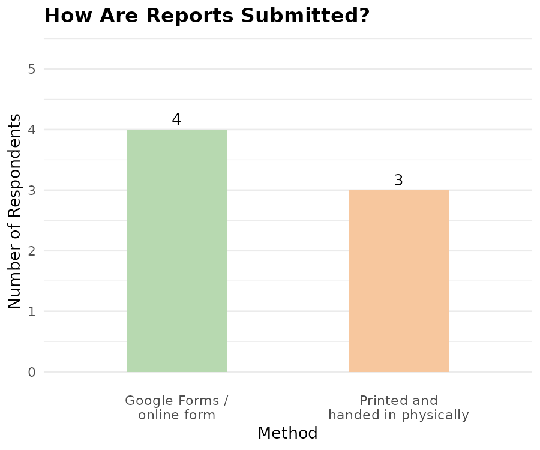
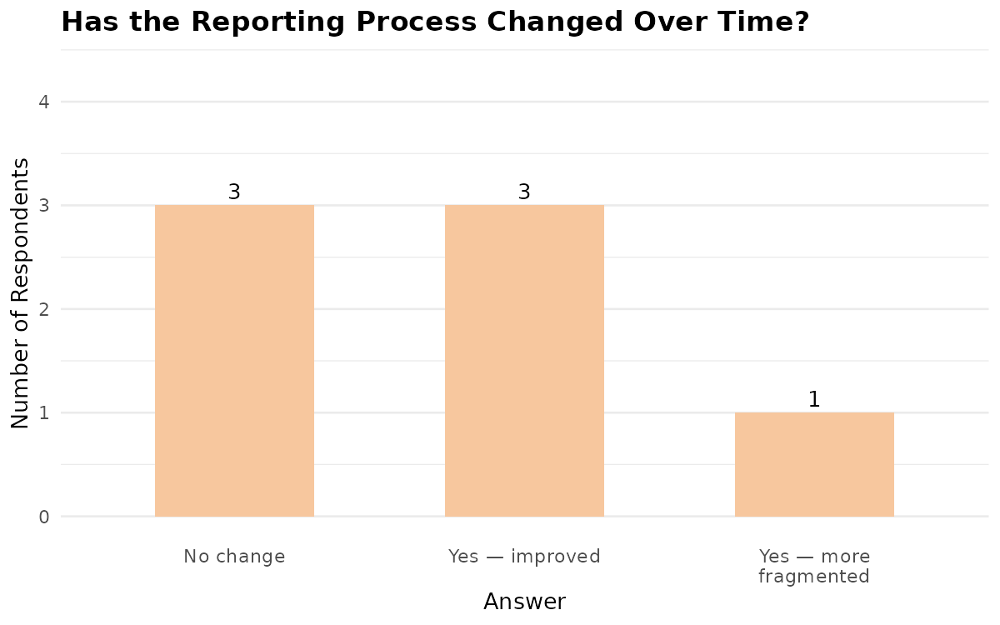

## Questions
**1.) Who are you and what is your function within your scouts organization?**
- P1: Tamara MF Manfreda, Vodnik, PP načelnica
- P2: Jutra Vukušič, vodnica 8 razreda, disciplinska komisija
- P3: Žiga Kranjc, vodnik voda
- P4: Adam Kanalec, Vodnik voda, MČ Načelnik
- P5: Tinkara Kavčič, vodnica GG voda
- P6: Ella Stamsnijder, Načelnica roda puntarjev tolmin
- P7: Žan Luka Remec, RR načelnik

**2.) If you have one, how do you currently manage the data of your scouts group? (badge progress, attendance, scolding and praise, ...)**
- P1: Po spominu
- P2: Veščine si napiše v fizično beležko, vse ostalo ni važno
- P3: Po spominu. Neki na telefon
- P4: Večino po spominu, če je večja akcija si napišem na papir in ga probam ne zgubit ali pa na telefon
- P5: Ponavad na notes na telefonu oziroma na whatsapp skupini z sovodniki
- P6: Na telefon v beležko
- P7: Trenutno nimam, drgač pa sm to delu večinoma po spominu

**3.) Do you find managing your scouts group data, the way you do now in any way difficult, tedious or confusing?**
- P1: Ne zapomnem si vseh imen veščin, kdo je naredu katero stvar
- P2: Ne
- P3: Ne
- P4: Ni tok težko, ampak sem anksious da ne ki pozabm
- P5: Ni težko, ampak nimam vsehga na enem mestu
- P6: Ne, bl je to da ne rabmo oddajat razn za občni zbor, kadar pa ne veš. Ne daja se sproti
- P7: Niti ne

<!--  -->

**4.) When creating an activity, do you ever check the reports of previous activities of the same type?**
- P1: Ne
- P2: Ne
- P3: Ja za taborjenje evalvacijo
- P4: Razen za veliko akcijo (zimovanje) ne
- P5: Delam manjše akcije, tko da ne
- P6: Samo če mam js sama to poročilo.
- P7: Samo, če sem jih delal jaz v preteklosti

**4.1) If yes, what is your process?**
- P1: 
- P2:
- P3: Na listu fizično sm dubu
- P4: Pisal osebmo prejšnji vodji akcije, če ima slučajno ona in dobil na ta način
- P5:
- P6: Pogledam svoje zapiske, če je tam je, če ni ni
- P7: Pogleda svoje datoteke na računalniku

**4.2) If no, why not?**
- P1: Za posamezne aktivnosti ne, za akcije pa bolj za strukturo akcije
- P2: Nevem, se zmislem ki bi delala in proba uno najboljš speljat
- P3:
- P4:
- P5: Ker so manjše akcije
- P6:
- P7: Ne vem kje jih najt

**5.) If you wanted to check different types of reports from previous years, how would you do that?**
- P1: Pogleda v svoj osebni arhiv na računalniku ozoroma praša posameznike
- P2: Uporabne povezave na discordu in poskušala poiskat prave povezave
- P3: Na drive bi šu, ampak tam ni vseh
- P4: Na google drive bi pogledu, če je je, če ni ni. Mogoče pisal osebno posameznikom.
- P5: RPT zakladnik, če je ta je, če ni ni. Če ne mogoče na kšnem discord kanalu
- P6: na google drive. Če je tam je, če ni ni. Mogoče pogledam na discord.
- P7: Večina teh poročil je nedostopna, predvsem ker ni skupnega arhiva, ampak so razpršeni med posamezniki.

**6.) Do you find accessing and searching through the current archive in any way difficult, tedious or confusing?**
- P1: Nima dostopa do arhiva
- P2: Ne
- P3: Razpršene poročila
- P4: Ni nadležno, samo cajt uzame
- P5: ne
- P6: Nevem če, drive je kr ok
- P7: Kater arhiv? Drive je pomanjkljiv, edino kar najdem na svojem računalniku.

**7.) Do you personally have to write any end-of-year reports? If yes, what is your process for writing and submitting each of them?**
- P1: Napišeš po spominnu in oddaš na anketo. Za načelnico na word in sprinta in odda fizično
- P2: Dobim se z sovodnikom, dobiva file in napiševa kar se spomneva.
- P3: Preberem evalvacijo akcije, napišem word poročilo in izpolnem obrazec za akcijo, za vod pa samo obrazec
- P4: Se odločim pomembne točke, pr vsaki malo napišem, najprej na list na grobo, potem na word. 
- P5: Pogledam poročilo od enga leta prej, z sovodniki, direktno v google forms in screenamo
- P6: Pogledam kar je od lani (moje + prejšnje funkcije). Ne vem kako more zgledat. Osnovam na prejšnja poročila.
- P7: Ko poročilo voda, se morem spomnit vse iz glave in ga oddam prek google obrazca. Ko delam poročilo funkcije, ga napišem na urejevalnik besedil na računalniku, nato sprintam in fizično prinesem na občni zbor.

**8.) Has the process of writing and submitting end-of-year reports changed in any way in your time as a scout leader?**
- P1: Včasih smo mel word obrazce, ki so sedaj ankete
- P2: Na bujš, zej je bl u uzi dobit stvari kod so in kam jih oddat
- P3: Ne
- P4: Ne
- P5: ne
- P6: Ja, smo šli iz papirja na google form
- P7: Ja, včasih smo to delal na papir vse, potem google drive, potem prek maila, zej prej google obrazca in del še vedno na papir.

**9.) Have the report templates or requirements changed in any way in your time as a scout leader?**
- P1: Nevem
- P2: Ja se je.
- P3: Ne
- P4: Ne
- P5: Nevem če
- P6: Drugačna vprašanja
- P7: Da, druga vprašanja.

**10.) Do you find the current workflow of creating and submitting different types of reports in any way difficult, tedious or confusing?**
- P1: To da moreš dat v fizični obliki
- P2: Občasno nadležen, skeptična da dela na telefonu
- P3: Confusing. Ne vem kako nardit (kaj vse more bit not)
- P4: Malo tedious, ker ne vem kako more zgledat. Ne vem kako delajo to drugi.
- P5: Nebi rekla
- P6: Ja, nadležno. Mogla bi sproti. Za vod se ne spomnem. Morem iskat.
- P7: Da, različna poročila je treba oddati na različne načine, nekatera moram celo sprintat in prinest fizično.

Ideje:
- Univerzalno poročilo, ki se updejta vsako leto. Še vedno imamo letna poročila, ampak namen univerzalnega poročila je da ko pripravljap akcijo lahko pogledaš le tega.

## Answers
### Who did we interview?
- scout leaders
- head of the scouting organization
- head of the scouting organization families
- disciplinary committee
### Questions regard three main themes:
- Managing the data of your scouting group during the course of the year
- Accessing and searching through the archive
- Writing and submitting reports
### Managing the data of scouting groups
- Most scout leaders rely on their memory or they write important information in their notebooks (phone and paper). Some use social apps like WhatsApp for both messaging their fellow scout leaders as well as saving the group's info
- Most don't find this difficult, tedious or confusing, but they did express that they sometimes feel anxious that they will forget something. Some do express that they forget things, because tracking is not really mandatory except for the end-of-year report. They also said that they do not have all the data saved in one place, which makes this a bit tiresome.
### Accessing and searching through the archive
- Most only check previous reports for larger multi-day activities and they do this by checking their own previous reports or ask specific people that had that activity for the report.
- They stated that accessing the archive is not difficult per se, but that the reports are spread out and lacking. Most look through a shared Google Drive or Discord and if they find it they do, if they don't they don't bother further. Maybe they would write to specific personnel who may have that report saved locally on their computer.
- The archive is spread out and lacking. They do not have a common archive that serves such a function.
### Writing and submitting reports
- Most rely on their memory to write the report at the end of the year. Some have some personal notes. Some look at their report from the previous year and write the new one based on it. Then depending on the report type they have to submit it differently. For the scouting group and activity report they use Google Forms, for function reports they write it in a text editor and then print it and bring it to the Annual General Meeting physically.
- The process of writing and submitting reports has changed multiple times over the years of some scout leaders. First they had paper templates that needed to be filled out with a pen, then they moved to writing them digitally and submitting them on Google Drive and then e-mail. Lastly as it is now they fill out Google Forms. For the function reports it has always stayed the same process of submitting the physical paper.
- Some reports have also changed their content and required information.
- Different reports need to be submitted in different ways, some even have to be printed and brought physically.
### Conclusion
Based on the answers we got from our potential users, we confirmed our hypothesis that:
1. The scouts organization does not have a clear and easy way to manage their group data during the course of the year.
2. The archive is practically non-existent, as the reports are first of all lacking and are also spread out with different people and as different file types.
3. The process of writing and submitting the end-of-year reports is not standardized and therefore unclear.
### Prototype
When shown, the scout leaders expressed excitement and praised the simplicity and usefulness of the prototype.