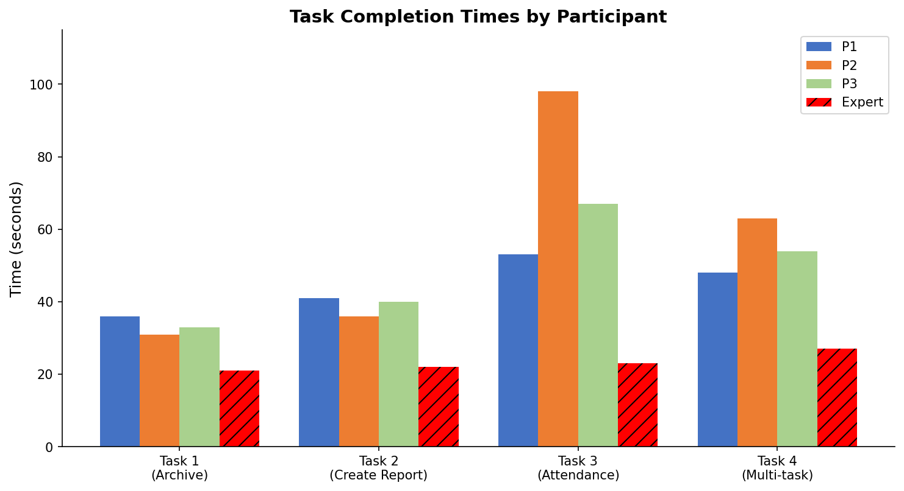
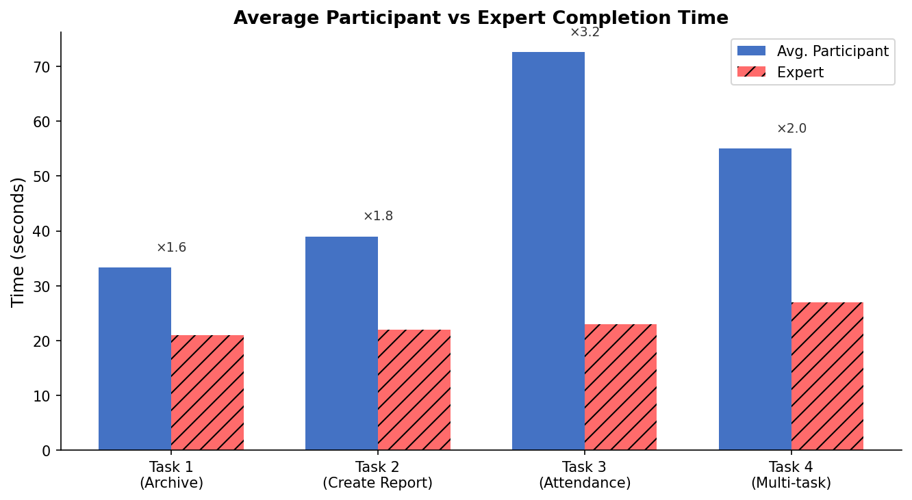

1. Navigate to the archive, find and open the reports for "načelnik" function 2024, group report 2024 and "Dan tabornikov" 2023.
2. Navigate to the section for creating reports and create a end-of-year report for "GG načelnik", fill it out quickly and submit it.
3. Add an attendance meeting for zimovanje and mark some scouts that they were present and others for missing.
4. Mark Eva, Sara and Tim that they fulfilled the "prenašanje ponesrečencev" requirement for the "bolničar" badge. Then add a scolding for Luka and lastly export the end-of-year group report.

P1: 36s, 41s, 53s, 48s 
Pri označevanju prisotnosti ni niti bral, ampak se zanašal na vizualne ques. Pri izbiri ustvarjanja poročila, se je zataknu, pr izbiri poročila, ker trzne, ampak moraš še klikniti gumb naprej.

P2: 31s, 36s, 1m38s, 1m03s
Ni znal označit odsotnosti (ni vedel, da mora klikniti dvakrat). Enako kot prvi mu ni našel novo ustvarjenega srečanja.

P3: 33s, 40s, 1m07s, 54s

My timing: 21s, 22s, 23s, 27s

# Usability Test Report

3 participants tested 4 tasks. Times in seconds.

| Task                    | P1  | P2  | P3  | Expert |
| ----------------------- | --- | --- | --- | ------ |
| 1 – Archive navigation  | 36  | 31  | 33  | 21     |
| 2 – Create a report     | 41  | 36  | 40  | 22     |
| 3 – Attendance tracking | 53  | 98  | 67  | 23     |
| 4 – Multi-action        | 48  | 63  | 54  | 27     |

Participants were on average **2–3× slower** than the expert, with Task 3 being the biggest problem.

## Key Issues Found

1. **Created meeting not clearly visible**
2. **double-click to mark absence** not discoverable
3. **Misleading animation** in report creation implies selection is done before pressing "Next".
