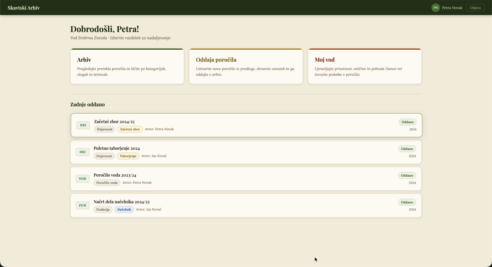
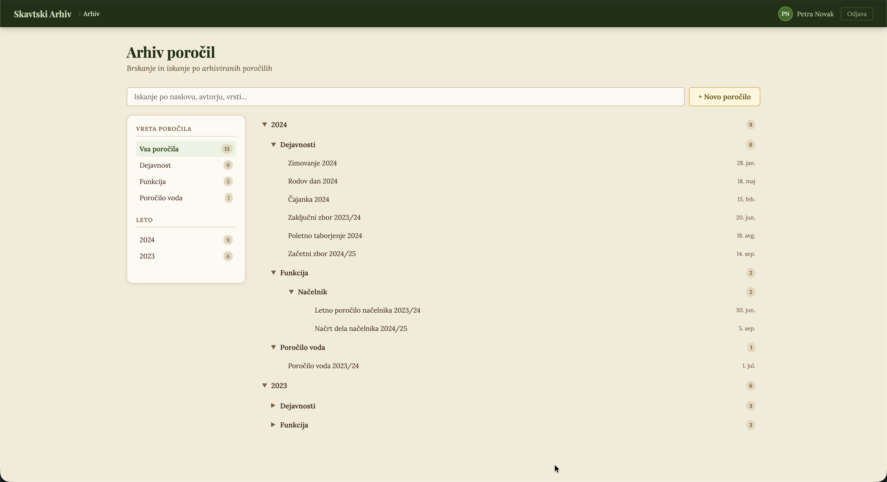
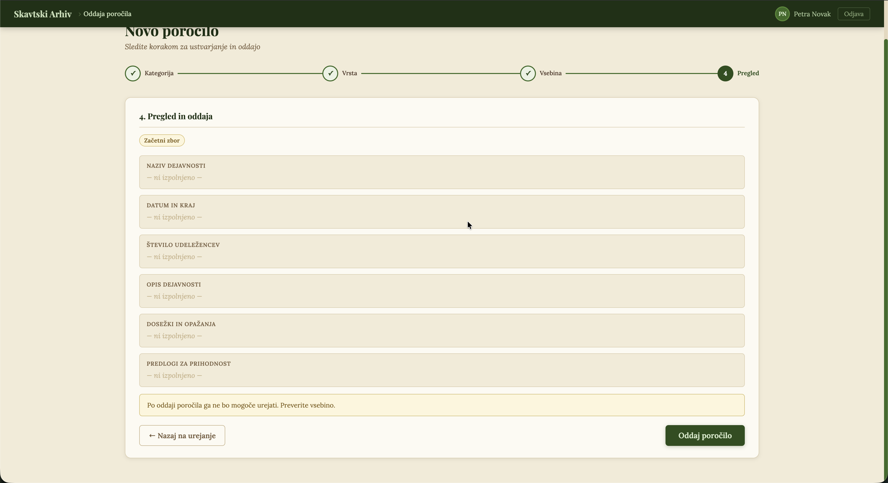
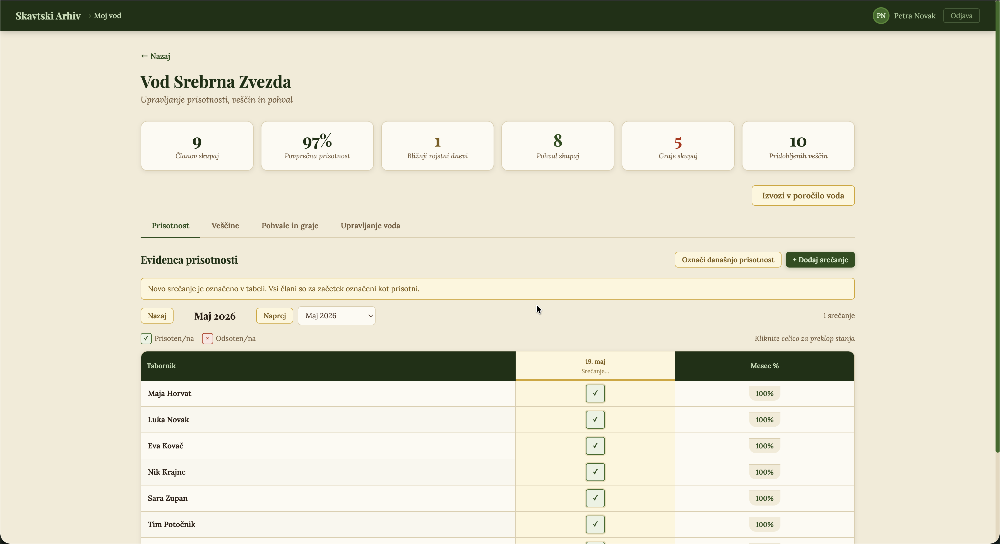
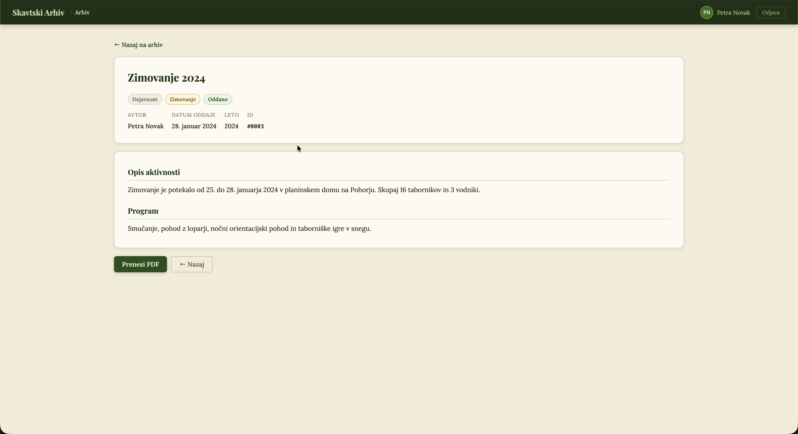

# Final Project Report: Archive System for a Local Scout Group (Rod)

**Course:** IT Management  
**Project:** Archive System for a Local Scout Group (Rod)  
**Client:** Local scout group (rod)  
**Team:** Luka Svenšek, Matej Kodermac, Žan Luka Remec, Gregor Ahlin, Lenart Svetek  
**Prepared by:** Žan Luka Remec  
**Date:** 16.05.2026  
**Repository:** https://github.com/AhlinGregor/MIT_Project2526/

## Outline

1. Introduction
2. Project Background and Objectives
3. Final Project Scope
4. Summary of Previous Homework
5. User Research and Requirements
6. Prototype and Final App Showcase
7. Usability Testing and Evaluation
8. Stakeholder and Risk Analysis
9. Team Work Assessment
10. Conclusions
11. Appendix: Source Material

## 1. Introduction

This report presents the final documentation for the Archive System for a Local Scout Group. It combines the work completed throughout the semester into one organized document: the project charter, personas, user stories, hypothesis testing, prototype work, usability testing, sprint planning, stakeholder analysis, and team-process reflection.

The project was developed iteratively. Because of that, earlier homework submissions do not always describe the same version of the system. Some roles changed, the team expanded when Lenart Svetek joined shortly after the beginning, and the prototype grew beyond the first archive-only idea. This final report uses the final project direction as the reference point and resolves earlier differences into one coherent description.

The core problem is that documentation inside a local scout group, or rod, is currently scattered across many places: personal computers, Google Drive, Discord, emails, paper notes, phone notes, and individual memory. This makes reports hard to find, hard to reuse, and easy to lose. The proposed system gives one scout group a central web application for creating, submitting, storing, searching, and reusing scouting documentation.

## 2. Project Background and Objectives

The Archive System for a Local Scout Group is a web-based archive and reporting platform. Its main objective is to make reporting simpler, more reliable, and more standardized inside one scout group.

The system is designed for scout leaders, scoutmasters, treasurers, administrators, and other members of the scout group who create or use reports. Instead of forcing users to search through old emails, personal folders, Google Drive links, or printed documents, the application provides a structured archive with search, filters, report templates, and submission workflows.

The project objectives are:

- Create a unified place for accessing and submitting scouting reports.
- Make old reports easier to search, browse, and reuse.
- Support both desktop and mobile use.
- Standardize report creation through structured forms and templates.
- Allow users to upload existing documents when needed.
- Help scout leaders maintain group information that later supports yearly reports.
- Provide a clearer administrative overview of submitted reports inside the scout group.
- Improve long-term reliability through centralized storage and backup planning.

The planned technical architecture is:

- **Frontend:** React-based responsive website.
- **Backend:** Node.js server with a REST API.
- **Database:** PostgreSQL for users, report metadata, group data, and structured records.
- **File storage:** Server-side file storage for uploaded documents such as PDF, Word, and spreadsheet files.
- **Security:** User accounts, encrypted passwords with Argon2, role-based permissions, and administrator privileges.
- **Infrastructure:** Main server, backup strategy, and possible high-availability setup for long-term reliability.

The current prototype is implemented as a front-end prototype in `docs/4. naloga/index.html`. It demonstrates the main workflows and user experience of the intended application.

## 3. Final Project Scope

The final project scope is broader than the first project idea. The original concept focused mainly on an archive and report submission system. Through personas, interviews, user stories, and testing, the scope expanded to include supporting tools that make report writing easier.

The final product scope includes:

- A login system with different user roles.
- A dashboard that routes users to the main parts of the application.
- A searchable archive organized by report type, year, category, and metadata.
- A report creation flow for structured reports.
- Upload support for existing report files.
- Template management for administrators.
- Attendance tracking for the scout group.
- Badge and skill progress tracking.
- Praise and scolding records.
- Member management.
- Export support for end-of-year group reports.

The archive and reporting workflow remains the center of the project. The group-management features support that core by helping scout leaders collect information during the year instead of reconstructing everything from memory at the end.

Lenart Svetek joined the team one or two weeks after the beginning of the project. From that point onward, he worked as an equivalent team member.

## 4. Summary of Previous Homework

This chapter connects the previous homework assignments into one project story. Each homework contributed a different layer: project definition, user understanding, requirements, validation, prototype testing, stakeholder thinking, and team reflection.

### 4.1 Homework 1: Project Charter

The project charter established the main idea: an archive system for scouting documentation. In the final version of the project, this scope is focused on one local scout group (rod), because this is the level where the team can define concrete users, reports, and workflows most clearly. The charter defined the client context, product purpose, expected result, rough architecture, requirements, team structure, and project deadline.

The most important outcome was the problem statement. A scout group needs a unified way to access, create, submit, and store reports. The charter also introduced several important product requirements: responsive access, simple use, archive hierarchy, search, user accounts, backups, and secure storage.

Key decisions from the charter:

- The product will be a web application.
- Reports will be organized by year and category.
- Users will be able to create reports directly in the system.
- Users will be able to upload existing documents.
- The system will support backup and long-term reliability.
- The system will use a modular architecture with frontend, backend, database, and file-storage components.

### 4.2 Homework 2: Personas

The persona homework helped define who the system is for. The project considered users with different responsibilities, technical confidence, and reporting habits.

The main personas were:

- **Samo Primer**, a digitally confident scout master who wants reliable access to mission plans and logs.
- **Amy Baum**, a junior scoutmaster who wants to reuse previous mission plans, create participant lists quickly, and submit plans from mobile devices.
- **Matevz Podgornik**, a scout leader who values simplicity and wants to finish administrative tasks quickly.
- **Andrej Kovac**, a treasurer who needs a simple way to upload and find annual financial reports.

These personas showed that the system must work for both frequent and occasional users. Some users want fast mobile workflows, while others need simple desktop workflows for yearly or financial reports. Across all personas, the repeated needs were centralized archive access, mobile and desktop support, simple report creation, reusable templates, secure long-term storage, and clear feedback after submission.

### 4.3 Homework 3: User Stories

The user stories translated the personas into concrete system behavior. They also provided testable scenarios that later shaped prototype design and usability testing.

Important user stories included:

- As a scoutmaster, I want to search past mission reports so that I can use them as templates.
- As a scoutmaster, I want to create a participant list from the member database so that I do not manually type every name.
- As a scoutmaster, I want to see the status of a submitted mission plan so that I know if it has been approved.
- As a scout leader, I want to create an activity report on my phone so that I can submit it immediately after the activity.
- As a scout leader, I want my reports to be automatically saved so that I do not lose my work.
- As a scout leader, I want to record attendance during an activity so that I can track who participated.
- As a treasurer, I want to upload the annual financial report so that I can submit it to the scout group archive.
- As a treasurer, I want to search past financial reports so that I can compare previous financial data.
- As a treasurer, I want financial reports to be stored in a secure central archive so that important documents are not lost.

These stories shaped the prototype around archive search, report creation, member data, attendance, and secure central storage.

### 4.4 Homework 4: Hypothesis Testing and Prototype

The hypothesis-testing homework validated the project idea through interviews with seven people from the scouting environment. The interviews focused on three areas:

- Managing scout group data during the year.
- Accessing and searching through the archive.
- Writing and submitting reports.

The results confirmed the main project hypothesis. Scout leaders often rely on memory, phone notes, paper notes, WhatsApp, Google Drive, Discord, or personal files. Reports are difficult to find because they are spread across different people, platforms, and formats. End-of-year reporting is not standardized, and different report types are submitted in different ways.

This homework also included the prototype in `docs/4. naloga/index.html`. The prototype demonstrates login, dashboard navigation, archive browsing, report creation, template management, attendance tracking, badge progress, praise/scolding notes, and member management.

### 4.5 Homework 5: Usability Testing

The usability-testing homework tested the prototype with three participants. Their task completion times were compared with an expert user.

The tested tasks were:

1. Navigate to the archive and open specific reports.
2. Create an end-of-year report for a function.
3. Add an attendance meeting and mark participants present or missing.
4. Complete multiple group-management actions and export an end-of-year group report.

Participants were generally two to three times slower than the expert user. The largest problem was attendance tracking.

The main usability issues were:

- A newly created meeting was not clearly visible.
- Double-clicking to mark absence was not discoverable.
- A report-type selection animation made users think the selection was finished before pressing "Next".

The usability charts from this homework are included below:

### 4.6 Homework 6: Sprint 0

Sprint 0 was used as the starting planning phase for the project. The intended purpose was to define the initial backlog and prepare the first development sprint.

The current Sprint 0 file is still incomplete, so the final exact sprint details need to be added manually:

- Sprint 0 backlog: [needs to be filled out by user]
- Sprint 1 plan: [needs to be filled out by user]
- Actual sprint goals: [needs to be filled out by user]
- Tasks completed in each sprint: [needs to be filled out by user]

### 4.7 Homework 7: Stakeholders

The stakeholder analysis identified people and organizations affected by the project.

Supportive stakeholders include:

- The local scout group (rod).
- Scout leaders and scoutmasters.
- Project team.
- Digital service providers.
- Scout Association of Slovenia as the wider scouting organization.
- Slovenian Ministry for Digitalization.

Neutral or potentially opposing stakeholders include:

- Financial accounting agents.
- European Union / GDPR enforcement context.
- Parents of scouts.
- Existing informal service providers such as Google Drive, OneDrive, and Discord.

The most important stakeholder concerns are resistance to changing existing workflows, privacy of personal data, GDPR compliance, and the risk that users continue using old informal tools if the new system is not clearly easier.

### 4.8 Homework 8: Team Patterns and Anti-Patterns

The final team-reflection homework evaluated the team's work process. The team identified several negative patterns: weak task delegation, unclear early role assignment, and lack of clear deadlines. These caused some rushed work and coordination issues.

The team also identified positive patterns: a relaxed work environment, honest discussion, open brainstorming, and individual initiative. These helped the team continue moving forward even when planning was imperfect.

This reflection explains why the project changed during development. The team learned from interviews, prototype work, testing, and its own coordination problems, then adapted the product and team roles accordingly.

## 5. User Research and Requirements

The research showed three main problems in the current scouting documentation process.

First, scout group data is not stored consistently. Many leaders rely on memory, paper notes, phone notes, or informal chat groups. This works for small everyday situations but becomes unreliable when reports must be written months later.

Second, the archive is incomplete and scattered. Reports may exist on Google Drive, Discord, personal computers, emails, paper, or only with a specific person. Users often search briefly and stop if the report is not easy to find.

Third, report writing and submission are not standardized. Some reports are submitted through Google Forms, some are written in Word, some are printed and delivered physically, and some depend on previous examples that are difficult to locate.

The final requirements are:

| Requirement area | Requirement                                                                                        |
| ---------------- | -------------------------------------------------------------------------------------------------- |
| Archive          | Users must be able to browse reports by year, type, function, activity, and category.              |
| Search           | Users must be able to search by keyword and filter metadata such as year, author, and report type. |
| Report creation  | Users must be able to create reports through structured forms.                                     |
| Upload           | Users must be able to upload existing report documents.                                            |
| Templates        | Users should be able to reuse old reports or predefined templates.                                 |
| Status tracking  | Submitted reports should show a clear status such as draft, submitted, approved, or archived.      |
| Mobile use       | Core workflows must work on mobile devices.                                                        |
| Desktop use      | Longer writing and archive-management workflows must work well on desktop.                         |
| Feedback         | The system must confirm important actions such as saving, uploading, and submitting.               |
| Auto-save        | Drafts should be saved automatically to reduce the risk of lost work.                              |
| Group data       | Attendance, badge progress, and member notes should support end-of-year reporting.                 |
| Security         | Users must log in, passwords must be encrypted, and access must be role-based.                     |
| Privacy          | The system must minimize stored personal data and support GDPR-compliant handling.                 |
| Backup           | The archive must be backed up so reports are not lost.                                             |

## 6. Prototype and Final App Showcase

The prototype demonstrates the final application concept. It is implemented as a local HTML prototype at:

`docs/4. naloga/index.html`

Demo users in the prototype:

- `admin / admin`
- `petra / tabornik`
- `jan / tabornik`

Main prototype areas:

- **Login:** users access the system through a username/password login.
- **Dashboard:** users choose between archive, report submission, group management, and administrative functions.
- **Archive:** users search and browse reports in a structured hierarchy.
- **Report submission:** users create new reports using a step-by-step flow.
- **Templates:** administrators manage report templates.
- **Group management:** users manage attendance, skills, praise/scolding entries, members, and report export.

### 6.1 Screenshot: Login and Dashboard

### 6.2 Screenshot: Archive Search and Browsing

### 6.3 Screenshot: Report Creation Flow

### 6.4 Screenshot: Group Management / Attendance

### 6.5 Screenshot: Final Submitted Report or Archive Detail

## 7. Usability Testing and Evaluation

The usability test showed that the prototype is useful and understandable, while also revealing interaction problems that need refinement.

Participants completed all major tasks, but they were generally slower than the expert user. Attendance tracking caused the most difficulty, mainly because the absence interaction was not discoverable enough and newly created meetings were not visible enough.

The most important improvements are:

- Make newly created meetings immediately visible after creation.
- Replace the double-click absence interaction with a clearer control.
- Make the report type selection flow clearer, especially the transition to the "Next" step.
- Test the prototype again after these changes.
- Include mobile testing, because several target workflows happen on phones.

Overall, the testing supports the project direction. Users reacted positively to the prototype and saw value in a simple, centralized archive and reporting system. The discovered problems are interface issues that can be corrected through iteration.

## 8. Stakeholder and Risk Analysis

The project has strong value for a local scout group because it can reduce administrative overhead, standardize reporting, and make the group archive usable in practice.

The biggest project risks are:

| Risk                                                        | Impact                                                         | Mitigation                                                                                                                |
| ----------------------------------------------------------- | -------------------------------------------------------------- | ------------------------------------------------------------------------------------------------------------------------- |
| Users continue using Google Drive, Discord, email, or paper | The new system may not become the real source of truth.        | Make the system clearly easier than the current workflow and support importing or uploading existing files.               |
| Resistance from less technical users                        | Some scout leaders may avoid the tool.                         | Keep the interface simple, mobile-friendly, and tested with real users.                                                   |
| GDPR and privacy concerns                                   | The system may store personal data about minors.               | Minimize collected data, use role-based access, encrypt passwords, document privacy rules, and support deletion requests. |
| Unclear ownership after the academic project                | The system may not be maintained.                              | Define a handover plan, hosting plan, backup process, and maintenance owner.                                              |
| Scope creep                                                 | Too many features may delay the core archive/reporting system. | Prioritize archive, report creation, search, upload, and security before advanced modules.                                |
| Incomplete sprint documentation                             | Some planning evidence is missing from the repository.         | Add the final sprint backlog and sprint history before submission.                                                        |

## 9. Team Work Assessment

The final team consisted of five equivalent members. Lenart Svetek joined one or two weeks after the beginning of the project and became a full team member from that point onward. The project roles evolved naturally as the work became clearer.

| Group member   | Final role                                      | Work performed                                                                                                                                                                                  | Assessment                                                                                                                                                 |
| -------------- | ----------------------------------------------- | ----------------------------------------------------------------------------------------------------------------------------------------------------------------------------------------------- | ---------------------------------------------------------------------------------------------------------------------------------------------------------- |
| Gregor Ahlin   | Project lead / DevOps                           | Gregor coordinated the general project direction, helped keep the team aligned, supported repository and infrastructure decisions, and contributed to project organization.                     | Gregor contributed to both coordination and technical direction. His work supported the project structure and helped the team keep a consistent direction. |
| Luka Svenšek   | Lead programmer / Developer                     | Luka worked on the technical side of the project, including prototype implementation, development decisions, and the programming-heavy parts of the system concept.                             | Luka made a strong technical contribution and helped turn the project idea into a working prototype direction.                                             |
| Žan Luka Remec | Scrum Master / Requirements and domain research | Žan Luka helped organize the project work, contributed domain knowledge from scouting, supported requirements definition, and participated in user research and project documentation.          | Žan Luka contributed strongly to understanding the problem domain and connecting user needs with the final product direction.                              |
| Matej Kodermac | Designer / Product contributor                  | Matej contributed to the product and interface direction, helped shape the user experience, and supported the team with design and documentation work.                                          | Matej's work helped make the prototype easier to understand and more coherent from the user's point of view.                                               |
| Lenart Svetek  | Developer                                       | Lenart joined shortly after the project began and became an equivalent member of the team. He contributed to development work and helped move the prototype and project implementation forward. | Lenart's later arrival did not make him a secondary member. He contributed as a full part of the development team after joining.                           |

If a more formal contribution split is required, add it here:

- Gregor Ahlin: [needs to be filled out by user]
- Luka Svenšek: [needs to be filled out by user]
- Žan Luka Remec: [needs to be filled out by user]
- Matej Kodermac: [needs to be filled out by user]
- Lenart Svetek: [needs to be filled out by user]

### 9.1 Team Process Assessment

The team had both strengths and weaknesses during the project. The main weaknesses were unclear early delegation, role changes, and deadlines that were not always planned early enough. These issues sometimes caused rushed work and made coordination harder than necessary.

At the same time, the team environment was relaxed and honest. Members could discuss ideas openly, give feedback, and take initiative when something needed to move forward. This helped the project continue improving even when the planning process was not perfect.

The team learned that clearer task ownership, earlier deadlines, and more consistent sprint planning would have improved the project. The final result still benefited from strong domain knowledge, practical user research, and a prototype that directly responds to real scouting problems.

## 10. Conclusions

The project confirmed that a local scout group has a real documentation and archive problem. Reports and group data are fragmented across different tools, formats, and people. Users often rely on memory, personal files, or informal communication channels, which makes long-term archiving unreliable.

The proposed archive system addresses this by creating one central web application for searching, writing, submitting, storing, and reusing reports. The prototype demonstrates the main workflows and expands the original archive idea with group-management tools that make end-of-year reporting easier.

User research and usability testing support the product direction. The concept is valuable, and users responded positively to the prototype. The main issues found during testing are fixable interaction problems, especially in attendance tracking and report creation flow.

The project is a strong foundation for a practical scouting archive and reporting platform. The next development stage should focus on finalizing the prototype screens, improving the tested usability issues, implementing the backend, defining privacy and security details, and preparing the system for real deployment.

## 11. Appendix: Source Material

The final report is based on the following previous homework files:

- `docs/1. naloga/projectCharter.md`
- `docs/2. naloga/persona.md`
- `docs/2. naloga/persona1.md`
- `docs/2. naloga/persona2.md`
- `docs/2. naloga/Persona 3.md`
- `docs/3. naloga/userStories.md`
- `docs/4. naloga/Hypothesis testing.md`
- `docs/4. naloga/index.html`
- `docs/5. naloga/Homework 5 - user testing.md`
- `docs/5. naloga/chart1.png`
- `docs/5. naloga/chart2.png`
- `docs/6. naloga/sprint0.md`
- `docs/7. naloga/stakeholders.md`
- `docs/8. naloga/antipaterns.md`
