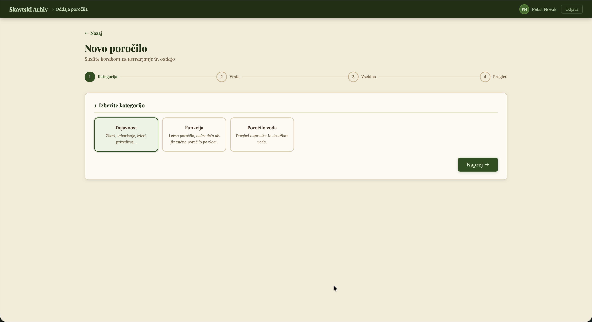
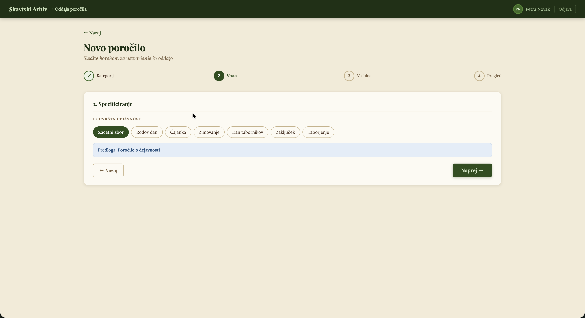
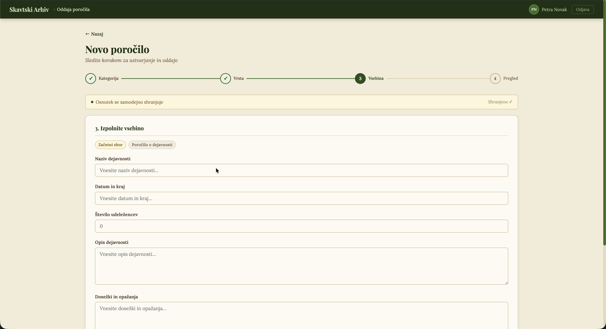

# Final Project Report: Archive System for a Local Scout Group (Rod)

**Course:** IT Management  
**Project:** Archive System for a Local Scout Group (Rod)  
**Client:** Rod Puntarjev Tolmin  
**Team:** Luka Svenšek, Matej Kodermac, Žan Luka Remec, Gregor Ahlin, Lenart Svetek  
**Prepared by:** Žan Luka Remec  
**Date:** 16.05.2026  
**Repository:** https://github.com/AhlinGregor/MIT_Project2526/

## Contents

1. Introduction
2. Project Idea and Goals
3. Final Scope
4. How the Project Developed
5. Research and Requirements
6. Prototype Screens
7. Usability Testing
8. Stakeholders and Risks
9. Teamwork
10. Conclusion

## 1. Introduction

This report describes the work our team did during the semester on an archive and reporting system for a local scout group, or rod. From the beginning, the system had two main parts: storing old reports and helping users create or submit new ones. As we did interviews, built the prototype, and tested it with users, we realized that the problem was wider than archive and reporting alone.

Because the project changed during the semester, some earlier documents do not describe exactly the same version of the system. Some team roles also changed, and the prototype grew into a three-part system: archive, reporting, and group management. In this report, we describe the final version, but also explain how we got there.

The main problem stayed the same from the beginning: documentation in a scout group is spread across too many places. Reports and useful notes can be on personal computers, Google Drive, Discord, email, paper, phone notes, or sometimes only in someone's memory. That makes older reports hard to find, hard to reuse, and easy to lose. Our proposed solution is one web application where a scout group can create, submit, store, search, and reuse its documentation.

## 2. Project Idea and Goals

The Archive System for a Local Scout Group is a web application for storing old reports and creating new ones. The main goal is to make reporting less scattered and easier to repeat from year to year.

The app is meant for scout leaders, scoutmasters, treasurers, administrators, and other members who either write reports or need to find them later. Instead of searching through old emails, personal folders, Google Drive links, and printed documents, they would have one place with search, filters, report templates, and a more organized way to submit new reports.

The project objectives are:

- Create a unified place for accessing and submitting scouting reports.
- Make old reports easier to search, browse, and reuse.
- Support both desktop and mobile use.
- Standardize report creation through structured forms and templates.
- Allow users to upload existing documents when needed.
- Help scout leaders maintain group information that later supports yearly reports.
- Give administrators a better overview of submitted reports.
- Improve long-term reliability through centralized storage and backup planning.

The planned technical architecture is:

- **Frontend:** React-based responsive website.
- **Backend:** Node.js server with a REST API.
- **Database:** PostgreSQL for users, report metadata, group data, and structured records.
- **File storage:** Server-side file storage for uploaded documents such as PDF, Word, and spreadsheet files.
- **Security:** User accounts, encrypted passwords with Argon2, role-based permissions, and administrator privileges.
- **Infrastructure:** Main server, backup strategy, and possible high-availability setup for long-term reliability.

The current prototype is still only a front-end prototype, located in `docs/4. naloga/index.html`. It does not include a real backend yet, so some parts are simulated. Still, it shows the main tasks we wanted to test and the kind of user experience we had in mind.

## 3. Final Scope

The final scope is broader than our first idea. At the start, we already imagined two connected parts: an archive where users could find old reports and a reporting part where users could create or submit new reports. After working on personas, interviews, user stories, and testing, it became clear that these two parts still did not solve the whole problem. Leaders also need a better way to collect group information during the year, so they are not trying to remember everything at the end.

In the final version, we included:

- A login system with different user roles.
- A dashboard that routes users to the main parts of the application.
- A searchable archive organized by report type, year, category, and metadata.
- A report creation flow for structured reports.
- Upload support for existing report files.
- Template management for administrators.
- Attendance tracking for the scout group.
- Badge and skill progress tracking.
- Praise and scolding records.
- Member management.
- Export support for end-of-year group reports.

The final system has three parts: archive, reporting, and group management. Archive and reporting were part of the idea from the beginning. Group management was added later because it gives leaders a place to collect information during the year. Attendance, badge progress, and member notes are exactly the kind of information that later becomes part of yearly reports. Looking back, this is where our scope became more ambitious than planned, but the extra features still came from the same reporting problem.

## 4. How the Project Developed

The project developed in several stages. We started with archive and reporting, then added group management after learning more about how scout leaders prepare documentation during the year. This section explains the main changes and decisions. The detailed research, prototype screens, usability results, risks, and team assessment are described later.

### 4.1 How It Became Three Parts

The first version of the idea focused on two connected tasks: storing and finding old scout reports, and creating or submitting new reports. Those problems stayed important throughout the project, but interviews and user stories showed that archive and reporting depend on information collected before the report is written. Reports are hard to write at the end of the year because important information is often collected informally during weekly activities, meetings, camps, and administrative work.

Because of this, the final version became a three-part system. Users should be able to create new reports, upload existing files, reuse previous reports as templates, and search the archive later. Group-management features such as attendance, badge progress, member notes, and report export were added as the third part because they produce information that later becomes part of formal documentation.

### 4.2 What We Learned from Users

We used personas, user stories, and interviews with real people from the scouting environment, so we would not design only for a generic "user." The personas helped us separate different responsibilities, while the interviews confirmed that documentation is often scattered across memory, paper notes, chat groups, Google Drive, Discord, email, and personal files. Scout leaders need fast activity reporting, scoutmasters need oversight and reusable plans, treasurers need reliable financial document storage, and administrators need template and archive control. These needs led to several product decisions:

- The application should work on both desktop and mobile devices.
- Report creation should be structured, not just a blank document upload.
- The archive should support search, filters, report metadata, and categories.
- Users should receive clear feedback after saving, uploading, or submitting.
- The system should include roles and permissions because not every user should access the same information.
- Personal data should be minimized and protected because scout groups may store information about minors.

### 4.3 The Prototype

The prototype was built as a front-end version of the main screens. It includes login, a dashboard, archive browsing, report creation, template management, attendance tracking, badge progress, praise/scolding notes, member management, and report export. The archive and reporting screens are the original core of the system, while the group-management screens show the part we added later.

The prototype also made the project easier to evaluate. Instead of only discussing requirements, users could try realistic tasks: opening old reports, creating a new report, adding attendance, and exporting an end-of-year report. This showed problems that we probably would not have noticed from written requirements alone. After the first usability test, we updated the prototype, so the screenshots in this report show the revised version rather than the first tested version.

### 4.4 Main Trade-Off

The biggest trade-off was scope. An archive and reporting system would be easier to implement, but it would not fully address why reports are difficult to prepare. Adding group management solves more of the real problem, but it also means more development work, more privacy responsibility, and more maintenance.

For the final project, we kept archive and reporting as the original core. Group-management features are treated as supporting parts that should only be developed further if the core archive, search, upload, report creation, security, and backup functions are stable. This keeps the project realistic, while still showing that reports depend on information collected throughout the year.

## 5. Research and Requirements

From the research, we found three main problems in the current scouting documentation process.

First, scout group data is not stored consistently. Many leaders rely on memory, paper notes, phone notes, or informal chat groups. That can work during everyday activities, but it becomes unreliable when reports must be written months later.

Second, the archive is incomplete and scattered. Reports may exist on Google Drive, Discord, personal computers, emails, paper, or only with a specific person. Scout leaders often search briefly and stop if the report is not easy to find, which means old work does not get reused as much as it could.

Third, report writing and submission are not standardized. Some reports are submitted through Google Forms, some are written in Word, some are printed and delivered physically, and some depend on previous examples that are difficult to locate. This is one reason why the same type of report can look different from year to year.

The main users are active executive members of the organization. This includes scout leaders, scoutmasters, treasurers, administrators, and other members who help with activities, reports, or organization work. Scout leaders need quick activity reporting and mobile access. Scoutmasters need oversight, reusable plans, and reliable archive search. Treasurers need secure storage for financial documents. Administrators need control over templates, users, and archive structure. These roles are different, but they all need the same basic thing: one dependable place where documentation can be created, submitted, found, and reused.

The final requirements are:

| Requirement area | Requirement                                                                                        |
| ---------------- | -------------------------------------------------------------------------------------------------- |
| Archive          | Users must be able to browse reports by year, type, function, activity, and category.              |
| Search           | Users must be able to search by keyword and filter metadata such as year, author, and report type. |
| Report creation  | Users must be able to create reports through structured forms.                                     |
| Upload           | Users must be able to upload existing report documents.                                            |
| Templates        | Users should be able to reuse old reports or predefined templates.                                 |
| Status tracking  | Submitted reports should show a clear status such as draft or archived.                            |
| Mobile use       | Core tasks must work on mobile devices.                                                            |
| Desktop use      | Longer writing and archive-management tasks must work well on desktop.                             |
| Feedback         | The system must confirm important actions such as saving, uploading, and submitting.               |
| Auto-save        | Drafts should be saved automatically to reduce the risk of lost work.                              |
| Group data       | Attendance, badge progress, and member notes should support end-of-year reporting.                 |
| Security         | Users must log in, passwords must be encrypted, and access must be role-based.                     |
| Privacy          | The system must minimize stored personal data and support GDPR-compliant handling.                 |
| Backup           | The archive must be backed up so reports are not lost.                                             |

## 6. Prototype Screens

The prototype shows what the final application could look like. It is implemented as a local HTML prototype at:

`docs/4. naloga/index.html`

The screenshots below show the revised prototype after the first usability-test iteration. The first prototype had several interaction problems, especially in attendance tracking and report-type selection. We corrected those issues before preparing these final screenshots.

Demo users in the prototype:

- `admin / admin`
- `petra / tabornik`
- `jan / tabornik`

The main parts of the prototype are:

- **Login:** users access the system through a username/password login.
- **Dashboard:** users choose between archive, report submission, group management, and administrative functions.
- **Archive:** users search and browse reports in a structured hierarchy.
- **Report submission:** users create new reports using a step-by-step flow.
- **Templates:** administrators manage report templates.
- **Group management:** users manage attendance, skills, praise/scolding entries, members, and report export.

### 6.1 Login and Dashboard

### 6.2 Archive Search and Browsing

### 6.3 Report Creation

### 6.4 Group Management and Attendance

### 6.5 Submitted Report

## 7. Usability Testing

The usability test was done on the first prototype iteration. Participants were able to complete the main tasks, but the test also revealed several interaction problems that we did not notice while building it.

Three participants tested the prototype. We compared their task completion times with an expert user to see where the interface slowed down first-time users. The tested tasks were:

1. Navigate to the archive and open specific reports.
2. Create an end-of-year report for a function.
3. Add an attendance meeting and mark participants present or missing.
4. Complete multiple group-management actions and export an end-of-year group report.

Participants completed all major tasks, but they were generally slower than the expert user. Attendance tracking caused the most difficulty, mainly because absence was marked with a double-click and newly created meetings were not visible enough. This was a good reminder that an interface can feel obvious to the people who built it and still be confusing for someone seeing it for the first time.

After the test, we used these findings to improve the prototype. The most important changes were to:

- Make newly created meetings immediately visible after creation.
- Replace the double-click absence interaction with a clearer control.
- Make the report type selection clearer, especially the transition to the "Next" step.

The test did not show that the whole idea was wrong. Instead, it showed that the first prototype needed clearer feedback and more obvious controls. Participants saw value in having one place for archive and reporting work, and the revised prototype fixes the main issues found during that test. A future version should still be tested again, especially on mobile devices, because several target tasks happen on phones.

## 8. Stakeholders and Risks

The project could be useful for a local scout group because it can reduce administrative work, standardize reporting, and make the archive easier to use in real situations. The important part is that the archive should not just be a folder for old documents. It should also help people create the next report more easily.

The groups most affected are the local scout group, scout leaders, scoutmasters, administrators, treasurers, parents, and our project team. The wider scouting organization and digital-service providers are affected more indirectly, because the system would change where documents are stored and how reporting habits develop. The biggest concerns are changing existing habits, privacy, long-term ownership, and whether users will actually prefer the new system over informal tools such as Google Drive, Discord, email, or paper notes.

The biggest project risks are:

| Risk                                                                | Impact                                                                 | Mitigation                                                                                                                |
| ------------------------------------------------------------------- | ---------------------------------------------------------------------- | ------------------------------------------------------------------------------------------------------------------------- |
| Scout leaders continue using Google Drive, Discord, email, or paper | The new system may not become the main place where reports are stored. | Make the system easier than the current process and support importing or uploading existing files.                        |
| Resistance from less technical scout leaders                        | Some scout leaders may avoid the tool.                                 | Keep the interface simple, mobile-friendly, and tested with real members of the scout group.                              |
| GDPR and privacy concerns                                           | The system may store personal data about minors.                       | Minimize collected data, use role-based access, encrypt passwords, document privacy rules, and support deletion requests. |
| Unclear ownership after the academic project                        | The system may not be maintained.                                      | Define a handover plan, hosting plan, backup process, and maintenance owner.                                              |
| Scope creep                                                         | Too many features may delay the core archive/reporting system.         | Prioritize archive, report creation, search, upload, and security before advanced modules.                                |
| Incomplete sprint documentation                                     | Some planning evidence is missing from the repository.                 | Add the final sprint backlog and sprint history before submission.                                                        |

## 9. Teamwork

The final team consisted of five members. Lenart Svetek joined one or two weeks after the beginning of the project and became a full team member from that point onward. The roles below show the main responsibility areas, although in practice the work was not always separated perfectly and several people helped outside their main role.

| Group member   | Final role                                      | Main contribution                                                                                                    |
| -------------- | ----------------------------------------------- | -------------------------------------------------------------------------------------------------------------------- |
| Gregor Ahlin   | Scrum master / DevOps                           | Helped coordinate the overall direction, repository work, and technical organization.                                |
| Luka Svenšek   | Lead programmer / Developer                     | Worked on the technical side of the project and helped turn the idea into a working prototype.                       |
| Žan Luka Remec | Project lead / Requirements and domain research | Contributed scouting domain knowledge, helped organize the work, and connected user needs with project requirements. |
| Matej Kodermac | Designer / Product contributor                  | Worked on the product and interface direction and helped make the prototype easier to understand.                    |
| Lenart Svetek  | Developer                                       | Joined shortly after the start and contributed to development work as a full team member.                            |

### 9.1 How We Worked as a Team

The team had both strengths and weaknesses during the project. The biggest weakness was that task delegation was not clear enough at the beginning. Because roles were assigned quickly and not very systematically, there were moments when everyone was doing a bit of everything. Deadlines were also not always set early enough, so some parts were more rushed than they needed to be.

At the same time, the team environment was relaxed and honest. Members could discuss ideas openly, give feedback, and take initiative when something needed to move forward. That helped the project keep improving even when our planning process was not perfect.

The main lesson is that clearer task ownership, earlier deadlines, and more consistent sprint planning would have improved the project. We are satisfied with the final direction, but we would organize the work differently if we started again. The final result still benefited from domain knowledge, user research, and a prototype based on real scouting problems.

## 10. Conclusion

The project confirmed that a local scout group has a real documentation and archive problem. Reports and group data are fragmented across different tools, formats, and people. Scout leaders often rely on memory, personal files, or informal communication channels, which is not reliable enough for long-term archiving.

We tried to solve this by designing one web application for searching, writing, submitting, storing, and reusing reports. The prototype shows the main tasks and expands the original two-part idea with group-management tools that make end-of-year reporting easier.

User research and usability testing support the general direction of the product. The idea is useful, and participants responded positively to having a simpler archive and reporting tool. The main issues found during testing were interaction problems, especially in attendance tracking and the report creation flow, and those issues guided the revised prototype shown in this report.

The project is a good starting point for a practical scouting archive and reporting platform. It is not finished software yet, and the prototype still has rough parts, but it shows a direction that makes sense for the problem. The next stage should focus on testing the revised prototype again, implementing the backend, defining privacy and security details, and preparing a realistic handover or deployment plan.
